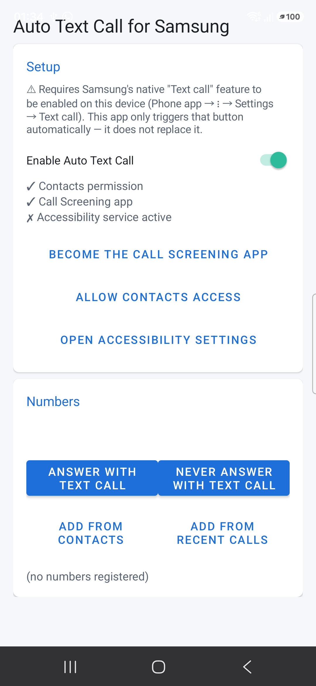
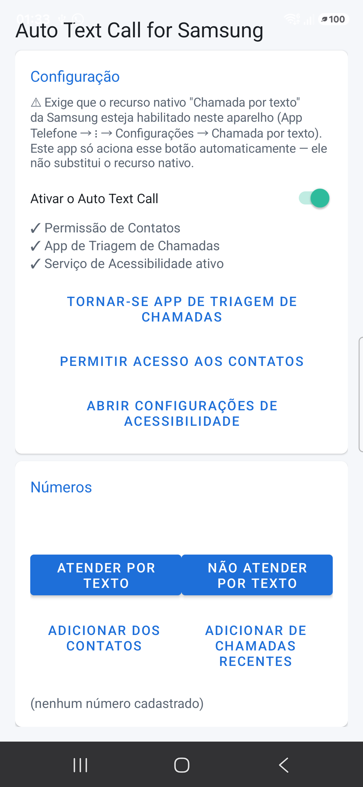

# Auto Text Call for Samsung

A last line of defense against spam and robocalls that slip through Samsung's built-in
call filtering. Instead of just blocking or silencing unknown numbers, it automatically
answers them using the native **Text call** feature (Bixby Text Call) of One UI —
forcing the caller into a text-only screening conversation instead of ever reaching you
by voice. Legitimate unknown callers can still explain themselves in text; spam callers
and robocalls typically can't or won't. Built and tested on a Galaxy A36
(One UI 7 / Android 15).

> ⚠ **Prerequisite**: this app does **not** implement text-call itself — it only
> automates Samsung's own button. **"Text call" must already be available and enabled
> on your device** (Phone app → ⋮ → Settings → Text call). If your device doesn't have
> this feature (it has historically been limited to Galaxy S/Z devices and specific
> languages), this app has nothing to trigger and won't work.

**Status: working.** Tested on-device: a call from a number outside Contacts is answered
automatically in Text call mode, with Samsung's default greeting.

 

## How it works

Two independent components in the same APK:

- **`AutoTextCallScreeningService`** (`CallScreeningService`, Android 10+) detects the
  incoming number — without needing `READ_PHONE_STATE` or `READ_CALL_LOG` — and checks it
  against Contacts and the app's own number list. If unknown, it silences the ringtone
  immediately and signals the intent (it never rejects or blocks the call).

- **`AutoTextCallAccessibilityService`** watches Samsung's call screen
  (`com.samsung.android.incallui`) and, when a number was signaled as unknown, performs
  the two taps needed to answer in text mode:
  1. The floating "Text call" button (`ai_call_floating_button_container`)
  2. The answer confirmation (identified by `contentDescription`, since it has no id)

These ids/descriptions were discovered empirically on this device with
`DumpAccessibilityService` (see below) and may change with One UI updates.

## Build

```bash
source env.sh
./gradlew assembleRelease
adb install -r app/build/outputs/apk/release/app-release.apk
```

Release builds are signed with a local keystore referenced by `keystore.properties`
(gitignored, never committed). Toolchain lives outside the repo, under `~/Android`:
SDK at `~/Android/Sdk`, JDK 17 (Temurin) at `~/Android/jdk`.

To generate your own signing key:

```bash
keytool -genkeypair -v -keystore ~/Android/keystores/autotextcall.jks \
  -alias autotextcall -keyalg RSA -keysize 2048 -validity 10000
```

and create `keystore.properties` at the repo root:

```properties
storeFile=/absolute/path/to/autotextcall.jks
storePassword=...
keyAlias=autotextcall
keyPassword=...
```

## On-device setup (one time)

Open **Auto Text Call for Samsung** and, on the main screen:

1. **Open Accessibility settings** → enable the service.
   If greyed out (Android 13+ blocks accessibility for sideloaded APKs):
   `App info → ⋮ → Allow restricted settings`.
2. **Become the Call Screening app** → grant it (this replaces any other
   screening/anti-spam app you use, since the role is exclusive).
3. **Allow Contacts access** → grant it.
4. Register extra numbers under "Numbers" — either "Answer with text call" (forces
   auto text-call even for a saved contact) or "Never answer with text call" (forces
   normal ringing even for an unknown number) — manually, from Contacts, or from Recent
   Calls.

## Debugging

```bash
adb logcat -s AutoTextCall
```

If a One UI update breaks the automation (ids/descriptions change), temporarily swap
`AutoTextCallAccessibilityService` for `DumpAccessibilityService` in
`AndroidManifest.xml`, reinstall, and repeat a test call to rediscover the current
identifiers.

## Known limitations

- The Call Screening role is exclusive to one app at a time on the device.
- Relies on internal One UI ids — may break on system updates.
- Requires the Accessibility permission to be granted manually (Android blocks
  automatic grants for sideloaded apps).
- Native "Text call" availability/language support varies by device and region — see
  the prerequisite above.
